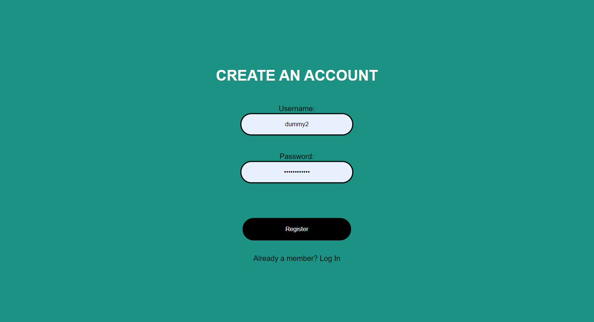
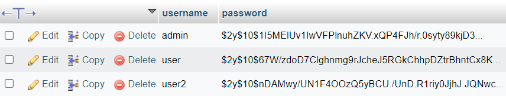
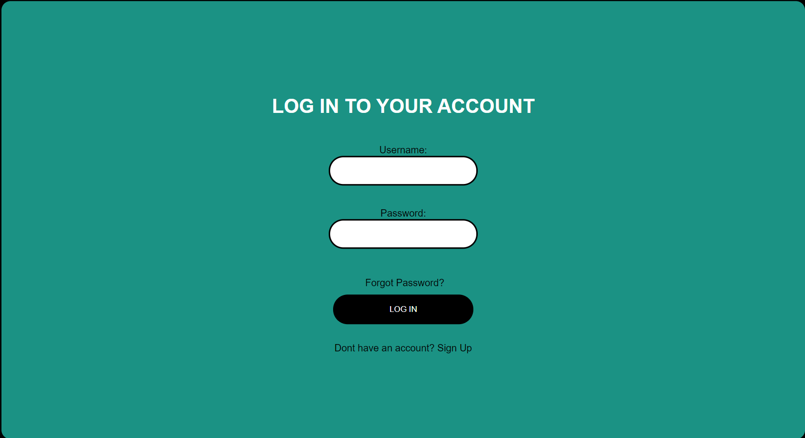

### 2. Authentication

In this part, we will be implementing Authentication measures which are:.  
1. Identification
2. Confirmation
3. Hashed password

Firstly, new user will need to register their account before they can access the web application.  
Here user needs to input their credentials such as username and password.  

------
            <form class="box" action="registerGP.php" method="post">
            <h1>CREATE AN ACCOUNT</h1>

            <label for="username">Username:</label>
            <input type="text" id="username" name="username"  pattern="[a-z0-9]+" required>  
      
      
            <label for="password">Password:</label>
            <input type="password" id="password" name="password" minlength="8" required>  
      
------

When user input their username and password and submitted the form, it will check in the database for any existing account with the same username. 

------
      $sql_check = "SELECT * FROM users WHERE username='$username'";
      $result_check = mysqli_query($conn, $sql_check);

    if (mysqli_num_rows($result_check) > 0) {
        // Show error message and redirect to registration page
        echo "";
      } elseif (strlen($password) < 8) {
        // Show error message and redirect to registration page
        echo "";
      } elseif (!preg_match('/^[a-zA-Z0-9]+$/', $username)) {
        // Show error message and redirect to registration page
        echo "";
      } else {
        // Insert the username and hashed password into the database
        $hashed_password = password_hash($password, PASSWORD_DEFAULT);
        $sql = "INSERT INTO users (username, password) VALUES ('$username','$hashed_password')";
        $result = mysqli_query($conn, $sql);

        if ($result) {
          // Get the generated ID
          $id = mysqli_insert_id($conn);
          // Registration successful, display success message and redirect to login page
          echo "";
          exit();
      }
       else {
          // Show error message and redirect to registration page
          echo "";
------

If existing username is found, it will prompt a pop up window.

If username is not found it will be stored in the database.  
Their password will be hashed and stored in the database.  

------
              } else {
        // Insert the username and hashed password into the database
        $hashed_password = password_hash($password, PASSWORD_DEFAULT);
        $sql = "INSERT INTO users (username, password) VALUES ('$username','$hashed_password')";
        $result = mysqli_query($conn, $sql);

        if ($result) {
          // Get the generated ID
          $id = mysqli_insert_id($conn);
          // Registration successful, display success message and redirect to login page
          echo "";
          exit();
      }
       else {
          // Show error message and redirect to registration page
          echo "";
        }
      }
    }

------

 

If username is not found, then user will be registered.

User will be redirected to the login page.   

User need to enter their username and password in order fer them to be authenticated.

-----------------
      <form class="box" action="login.php" method="post">
      <h1>LOG IN TO YOUR ACCOUNT</h1>

      <label for="username">Username:</label>
      <input type="text" id="username" name="username" required>  
      
      <label for="password">Password:</label>
      <input type="password" id="password" name="password" required>  
      
      <input type="hidden" name="csrf_token" value="<?php echo htmlspecialchars($_SESSION['csrf_token']); ?>">
      
      <input type="submit" value="LOG IN"/>
  
      

        Don't have an account?<a href="registerGP.php"> Sign Up </a>
      

    </form>
---------------------

Once user click the log in button it wil call the [login.php](html/login.php)  
Here, username and password will be compared to the username and hashed password in the database.  

---------------------
      // Check if user exists in the database
            if (mysqli_num_rows($result) == 1) {
                $user = mysqli_fetch_assoc($result);
                $db_password = $user['password'];

                // Validate password against whitelist pattern
                if (!preg_match($password_pattern, $password)) {
                    exit('Invalid password format.');
                }

                // Verify password
                if (password_verify($password, $db_password)) {
                    // Login successful, generate random session ID
                    $session_id = bin2hex(random_bytes(16));

                    // Save user session with random session ID and last activity time
                    $_SESSION['username'] = $username;
                    $_SESSION['session_id'] = $session_id;
                    $_SESSION['last_activity'] = time();

                    // Redirect to home.php or privilege.php if the username is "admin"
                    if ($username === 'admin') {
                        header("Location: privilege.php");
                    } else {
                        header("Location: menuGP.php");
                    }
                    exit();
                } else {
                    // Wrong password, display error message
                    exit('Wrong password. Please try again.');
                }
            } else {
                // No username exists, display error message
                exit('Invalid username. Please try again.');
            }
        }
    }
---------------------

If Username or pasword did not match or wrong, a window will pop out.  

User will need to enter the correct username and password in order for them to authenticated again.   
