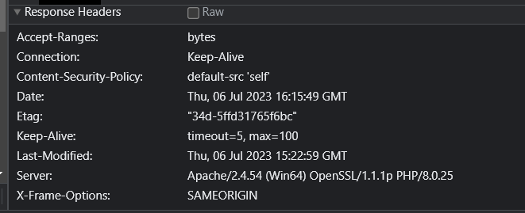

### 5. CSRF Prevention

# Content Security Policy
CSP header sets the policy to allow content only from the same origin ('self')
Preventing clickjacking attacks (X-Frame-Options)
Enforcing a content security policy to mitigate cross-site scripting (XSS) and other code injection vulnerabilities (Content-Security-Policy).

            Header always set Content-Security-Policy "default-src 'self'; style-src 'self' 'unsafe-inline'; font-src 'self'; media-src 'self'"
# X-Frame-Options

------
        <?php
         header("X-Frame-Options: DENY");
         ?>

This option specifies that the page should not be displayed in any frame or iframe. It provides the strongest protection but completely prevents the page from being embedded anywhere.

       <?php
       // header("X-Frame-Options: SAMEORIGIN");
       ?>
------

 This option allows the page to be displayed in a frame or iframe only if the site embedding the page has the same origin (same domain, protocol, and port) as the page itself. It provides a balance between security and usability, allowing the page to be embedded on the same domain.

# Security Purpose 
 Control the framing behavior of your web pages and protect them from being maliciously embedded in iframes on other websites. It helps to ensure that your website is displayed within a trusted context and prevents potential security vulnerabilities.

# Shortcut
Rather than making a file containing X-Frame-Options and CSP, we insert 2 lines of code in the httpd.config file as apache configuration  and it will automatically called the CSP and X-Frame-Options in every header

------
     Header always set X-Frame-Options "SAMEORIGIN" 
------

    Header always set Content-Security-Policy "default-src 'self'"
------

# Header Response

# Anti-CSRF token

## Generating an CSRF token whenever a user register or logs in. In a session, it persists throughout the session until the user logs out. To avoid session hijacking, the website validates the CSRF token attached to the user's session, through the header or hidden input. If the CSRF token is mismatched user will be exited from the home page. If it matches, user can continue browsing as usual.

Through the header
------
     if (!isset($_SESSION['csrf_token'])) {
    $_SESSION['csrf_token'] = bin2hex(random_bytes(32));
}

      // Check if the request method is POST
      if ($_SERVER['REQUEST_METHOD'] === 'POST') {
    // Check if user has submitted the form
    if (isset($_POST['username']) && isset($_POST['password']) && isset($_POST['csrf_token'])) {
        // Validate CSRF token
        if ($_POST['csrf_token'] !== $_SESSION['csrf_token']) {
            // Show error message and redirect to login page
            exit('Error: Invalid CSRF token.');
        } else {
            $username = $_POST['username'];
            $password = $_POST['password'];

------

After user logs in and is redirected to menuGP.php or when they wanna book a venue, the website validates the CSRF token again.

------

      <?php
      require_once('../html/idle.php');  
      
      
      // Check if the CSRF token exists in the session
      if (isset($_SESSION['csrf_token'])) {
          $csrf_token = $_SESSION['csrf_token'];
      } else {
          // CSRF token is not found, redirect to login page
          echo '';
          exit();
      }
      ?>

-----

Through the hidden input field
(in login.php)
-----
       <input type="password" id="password" name="password" required>  
      
      <input type="hidden" name="csrf_token" value="<?php echo htmlspecialchars($_SESSION['csrf_token']); ?>">
      
      <input type="submit" value="LOG IN"/>
  
-----
